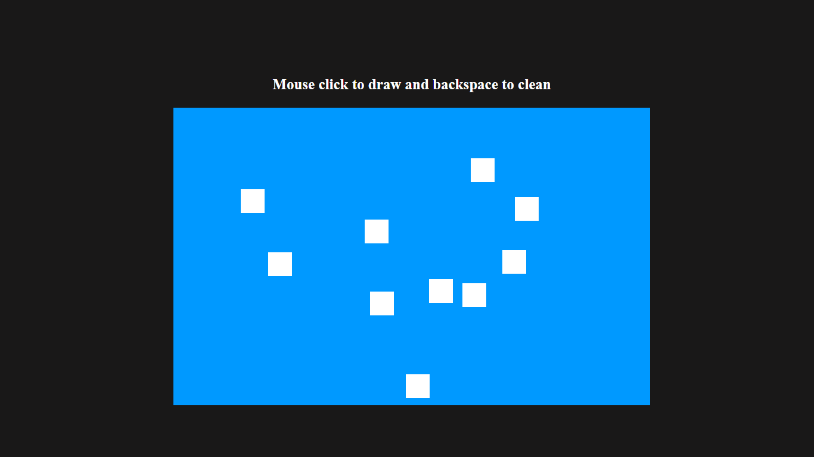

# Blocks

## Table of contents

- [Overview](#overview)
  - [The challenge](#the-challenge)
  - [Screenshot](#screenshot)
  - [Links](#links)
- [My process](#my-process)
  - [Built with](#built-with)
- [Author](#author)

## Overview

### The challenge

- Create a project that manipulates a canvas, to create small blocks where clicked.

### Screenshot

### Links

- Live Site URL: [Solution](https://victorgelado.github.io/BlockJs/)

## My process

### Built with

- HTML5 markup
- CSS custom properties
- JavaScript

## Author

Made by **VictorGelado**

  
  
  <a href="mailto:victorgeladocontato@gmail.com" target="_blank">

